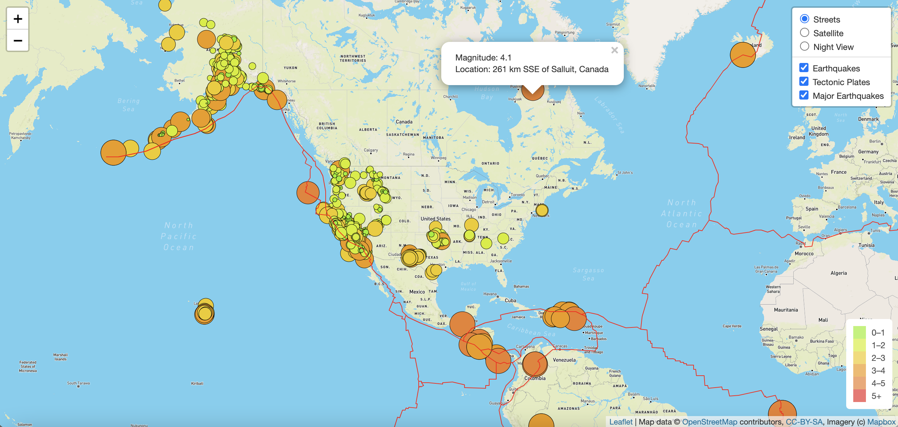
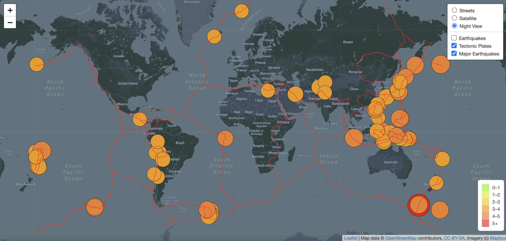

# Mapping_Earthquakes
Using JavaScript, D3, Leaflet.js API, and Mapbox to create an interactive earthquake tracking map

## Overview
The purpose of this project was to display real time earthquake data through an interactive and web application that could be filtered to show a variety of data over different map types. Through this web page, a user would be able to see a global map with (1) markers indicating the locations of earthquakes that occurred over the course of the last seven days, (2) An outline of the tectonic plate boundaries, and (3) a variety of map styles and filters to apply.  Additionally, the markers’ size and color would indicate the magnitude of the earthquake. The magnitude along with location could be accessed by clicking on the marker. 

## Resources
  * JavaScript
  * HTML
  * CSS
  * Leaflet
  * Mapbox
  * GeoJSON
  * VS Code
  * Google Chrome DevTools

# Process overview
In order to create the web page displaying earthquake data, the following steps were completed. First, the web page was set up using HTML with links to Leaflet and CSS stylesheets. Scripts to D3 and JavaScript files that would hold the logic code were also included. Next, the background tile layers were created using Leaflet with styles from Mapbox. Then, GeoJSON earthquake data was parsed into a LayerGroup to be overlaid on the Mapbox maps. Then markers were created and styled to vary in color and size based on the earthquake magnitudes. Next, the tectonic plate layer was created in a similar way as the earthquake data layer. Lastly, the layer containing only earthquakes with magnitudes of 4.5 or greater was created with styled markers. 

Earthquake map with interactive buttons, maps, and layers

Earthquake map with Night View, Tectonic Plates, and Major Earthquakes selected

